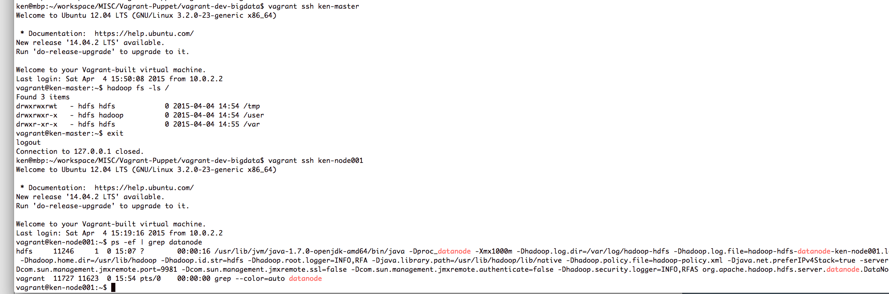

This module is a continuation of the <a href="https://wwken.wordpress.com/2015/03/21/setting-up-a-virtual-machine-locally-using-vagrant-and-puppet-1/" target="_blank">Vagrant-puppet tutorial part 1</a>.  The goal of this module is to show you how to set up a hadoop cdh5 Cloudera version running on few virtual boxes on your machine (In this tutorial, i created 1 master node and 2 slave nodes).  If you have not gotten time to go through the part 1, the minium requirment to make any sense out form this module is to understand how to use vagrant to get the virtual box running at least.

###How to install

First, git clone this module to let say ~/vagrant-dev-bigdata folder, then you will have to ensure that:

- vagrant-hostmanager is installed.  If not, run: <pre>vagrant plugin install vagrant-hostmanager</pre>
- <a href="https://github.com/wikimedia/puppet-cdh" target=_blank>Puppet-cdh</a> module is installed in the puppet/module folder
- <a href="https://github.com/puppetlabs/puppetlabs-stdlib" target=_blank>Stdlib module</a> is in the puppet/module folder
- <a href="https://github.com/puppetlabs/puppetlabs-apt" target=_blank>Apt module</a> is in the puppet/module folder

###How to run / play around with it
Just simply run 'vagrant up' to bring up all boxes:
<pre>
  ken@mbp: ~/vagrant-dev-bigdata$ <b>vagrant up</b>
</pre>

Then, type 'vagrant ssh ken-master' to login the master box:
<pre>
  ken@mbp: ~/vagrant-dev-bigdata$ <b>vagrant ssh ken-master</b>
</pre>

Inside the master node, you can type 'hadoop fs -ls /' to verify that the hdfs namenode is indeed running!
<pre>
  vagrant@ken-master:~$ <b>hadoop fs -ls /</b>
    Found 3 items
    drwxrwxrwt   - hdfs hdfs            0 2015-04-04 14:54 /tmp
    drwxrwxr-x   - hdfs hadoop          0 2015-04-04 14:54 /user
    drwxr-xr-x   - hdfs hdfs            0 2015-04-04 14:55 /var
  vagrant@ken-master:~$
</pre>

Logged out the master node and go inside one of the data node, say, ken-node002 (by typing 'vagrant ssh ken-node002') and verify that the datanode is indeed running:
<pre>
vagrant@ken-master:~$ <b>exit</b>
  logout
  Connection to 127.0.0.1 closed.
ken@mbp:~/vagrant-dev-bigdata$ <b>vagrant ssh ken-node001</b>
  Welcome to Ubuntu 12.04 LTS (GNU/Linux 3.2.0-23-generic x86_64)

  * Documentation:  https://help.ubuntu.com/
  New release '14.04.2 LTS' available.
  Run 'do-release-upgrade' to upgrade to it.

  Welcome to your Vagrant-built virtual machine.
  Last login: Sat Apr  4 15:19:16 2015 from 10.0.2.2
vagrant@ken-node001:~$ <b>ps -ef | grep datanode</b>
  hdfs     11246     1  0 15:07 ?        00:00:16 /usr/lib/jvm/java-1.7.0-openjdk-amd64/bin/java -Dproc_datanode     -Xmx1000m -Dhadoop.log.dir=/var/log/hadoop-hdfs -Dhadoop.log.file=hadoop-hdfs-datanode-ken-node001.log           -Dhadoop.home.dir=/usr/lib/hadoop -Dhadoop.id.str=hdfs -Dhadoop.root.logger=INFO,RFA  -Djava.library.path=/usr/lib/hadoop/lib/native -Dhadoop.policy.file=hadoop-policy.xml -Djava.net.preferIPv4Stack=true -server -Dcom.sun.management.jmxremote.port=9981 -Dcom.sun.management.jmxremote.ssl=false -Dcom.sun.management.jmxremote.authenticate=false -Dhadoop.security.logger=INFO,RFAS org.apache.hadoop.hdfs.server.datanode.DataNode
  vagrant  11727 11623  0 15:54 pts/0    00:00:00 grep --color=auto datanode
vagrant@ken-node001:~$
</pre>

You should be able to see something like below (If everything is setup correctly):

